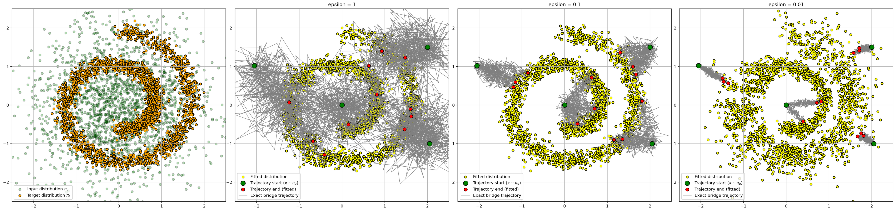
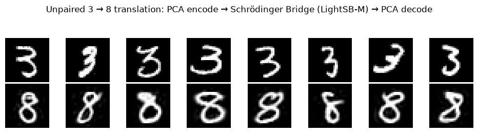
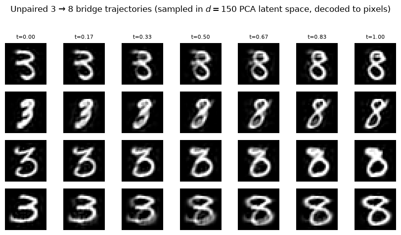

# Optimal Schrödinger Bridge Matching

---

## Problem Formulation

Given two marginal distributions $\pi_0, \pi_T \in \mathcal{P}(\mathbb{R}^d)$ and a reference path measure $\mathbb{Q} \in \mathcal{P}(C([0,T];\mathbb{R}^d))$ defined by the SDE $d\boldsymbol{X}_t = \boldsymbol{f}(\boldsymbol{X}_t,t)dt + \sigma_td\boldsymbol{B}_t$ and the control path measure  $\mathbb{P}^u \in \mathcal{P}(C([0,T];\mathbb{R}^d))$ with  $d\boldsymbol{X}_t = ( \boldsymbol{f}(\boldsymbol{X}_t,t) + \sigma_t \boldsymbol{u}(\boldsymbol{X}_t,t))dt + \sigma_td\boldsymbol{B}_t$, the **dynamic Schrödinger Bridge** seeks the path measure $\mathbb{P}^\star$ of minimal KL divergence from $\mathbb{Q}$ subject to the marginal constraints:

$$\mathbb{P}^\star = \arg\min_{\mathbb{P}^u \in \mathcal{P}(C([0,T];\mathbb{R}^d))} \mathrm{KL}(\mathbb{P}^u  \| \mathbb{Q} ) \quad \text{s.t.} \quad \mathbb{P}^u _0 = \pi_0,  \mathbb{P}^u _T = \pi_T$$

By Girsanov's theorem, the path-space KL divergence reduces to a kinetic energy cost over the control drift $\boldsymbol{u}$:

$$\mathrm{KL}(\mathbb{P}^u \| \mathbb{Q}) = \mathbb{E}_{\boldsymbol{X}_{0:T} \sim \mathbb{P}^u}\left[\int_0^T \frac{1}{2}\|\boldsymbol{u}(\boldsymbol{X}_t, t)\|^2 dt\right]$$

---

## Wiener Prior

When $\mathbb{Q} = \mathbb{W}^\epsilon$ with $\boldsymbol{f} \equiv 0$ and $\sigma_t = \sqrt{\epsilon}$, the problem reduces to learning the **adjusted Schrödinger potential** $v^\star : \mathbb{R}^d \to \mathbb{R}_+$, which fully determines both the optimal coupling and the optimal drift of $\mathbb{P}^\star $:

$$
\boldsymbol{u}^\star(\mathbf{x}, t) = \sqrt{\epsilon} \nabla_\mathbf{x} \log \left( \int_{\mathbb{R}^d} \mathcal{N}(\mathbf{x}_T \mid \mathbf{x}, (T-t) \mathbf{I}_d ) e^{\frac{|\mathbf{x}_T|^2}{2\epsilon}} v^\star(\mathbf{x}_T)  d\mathbf{x}_T \right)
$$

---

## LightSB-M

**LightSB-M** parameterizes $v_\theta(\boldsymbol{x}_T) = \sum_{k=1}^K \alpha_k \mathcal{N}(\boldsymbol{x}_T \mid \boldsymbol{\mu}_k, \boldsymbol{\Sigma}_k)$ as a Gaussian mixture and optimizes the bridge matching loss:

$$
\mathcal{L}(\theta) = \frac{1}{2\epsilon} \int_0^T \mathbb{E}\left[ \left\| \sigma_t \boldsymbol{u}_{v_\theta}(\boldsymbol{X}_t, t) - \frac{\boldsymbol{X}_T - \boldsymbol{X}_t}{T - t} \right\|^2 \right] dt
$$

where the drift $\sigma_t \boldsymbol{u}_{\theta}(\boldsymbol{x}, t)$ admits the **corrected** closed form:

$$
\sigma_t \boldsymbol{u}_{\theta}(\boldsymbol{x}, t) = \epsilon \, \nabla_{\boldsymbol{x}} \log \left( \mathcal{N}(\boldsymbol{x} \mid 0, (T-t)\epsilon \, \mathbf{I}_d) \sum_{k=1}^{K} \alpha_k \, \mathcal{N}(\boldsymbol{\mu}_k \mid 0, \epsilon \boldsymbol{\Sigma}_k) \, \mathcal{N}\big( \boldsymbol{A}_k(t)^{-1} \boldsymbol{h}_k(t) \,\big|\, 0, \boldsymbol{A}_k(t)^{-1} \big)^{-1} \right)
$$

where

$$
\boldsymbol{A}_k(t) := \frac{t}{T(T-t)\epsilon} \, \mathbf{I}_d + \frac{\boldsymbol{\Sigma}_k^{-1}}{\epsilon}, \qquad \boldsymbol{h}_k(\boldsymbol{x}, t) := \frac{1}{\epsilon} \left( \frac{\boldsymbol{x}}{T-t} + \boldsymbol{\Sigma}_k^{-1} \boldsymbol{\mu}_k \right)
$$

## Experimental Results

### Experiment 1: Gaussian-to-Swiss Roll
2D Gaussian-to-Swiss-roll transport task across three entropic regularization regimes, $\epsilon \in \{1, 0.1, 0.01\}$

### Experiment 2: Unpaired 3-to-8 Image Translation
Pipeline visualization and generated trajectories for the 3-to-8 experiment:

<table>
  <tr>
    <td align="center"><b>Pipeline</b> </td>
    <td align="center"><b>Trajectory</b> </td>
  </tr>
</table>

---

## References

- Gushchin et al. (2024). *Light and Optimal Schrödinger Bridge Matching*. ICML 2024.
- Korotin et al. (2024). *Light Schrödinger Bridge*. ICLR 2024.
- Tang (2026). *Foundations of Schrödinger Bridges for Generative Modeling*.
